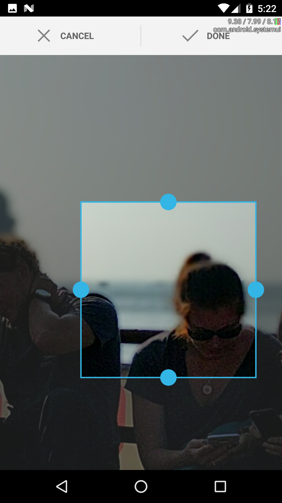

# cordova-plugin-crop

> Crop an image in a Cordova app


## Install

```
$ cordova plugin add --save cordova-plugin-crop
```


## Usage

```js
plugins.crop(function success () {

}, function fail () {

}, '/path/to/image', options)
```

or, if you are running on an environment that supports Promises
(Crosswalk, Android >= KitKat, iOS >= 8)

```js
plugins.crop.promise('/path/to/image', options)
.then(function success (newPath) {

})
.catch(function fail (err) {

})
```

## API

 * quality: Number

The resulting JPEG quality (ignored on Android). default: 100

 * targetWidth: Number

The resulting JPEG picture width. default: -1

 * targetHeight: Number

The resulting JPEG picture height. default: -1

## Ionic / Typescript Example Angular 2 Service



This is an example service that uses ionic-native's built in camera and the cordova-plugin-crop to create a cropped version of the image and return the file path. 

```js
import { Injectable } from '@angular/core';
import { Platform } from 'ionic-angular';
import { Camera, Crop } from 'ionic-native';

@Injectable()
export class CameraService {

  public options: any = {
        allowEdit: true,
        sourceType: Camera.PictureSourceType.SAVEDPHOTOALBUM,
        mediaType: Camera.MediaType.ALLMEDIA,
        destinationType: Camera.DestinationType.FILE_URI
  }
  
  constructor(public platform: Platform) {}

  // Return a promise to catch errors while loading image
  getMedia(): Promise<any> {
    // Get Image from ionic-native's built in camera plugin
    return Camera.getPicture(this.options)
      .then((fileUri) => {
        // Crop Image, on android this returns something like, '/storage/emulated/0/Android/...'
        // Only giving an android example as ionic-native camera has built in cropping ability
        if (this.platform.is('ios')) {
          return fileUri
        } else if (this.platform.is('android')) {
          // Modify fileUri format, may not always be necessary
          fileUri = 'file://' + fileUri;

          /* Using cordova-plugin-crop starts here */
          return Crop.crop(fileUri, { quality: 100, targetWidth: -1, targetHeight: -1 });
        }
      })
      .then((path) => {
        // path looks like 'file:///storage/emulated/0/Android/data/com.foo.bar/cache/1477008080626-cropped.jpg?1477008106566'
        console.log('Cropped Image Path!: ' + path);
        return path;
      })
  }
  
}  
```


### Libraries used

 * iOS: [PEPhotoCropEditor](https://github.com/kishikawakatsumi/PEPhotoCropEditor)
 * Android: [android-crop](https://github.com/jdamcd/android-crop)

## License

MIT © [Jeduan Cornejo](https://github.com/jeduan)
